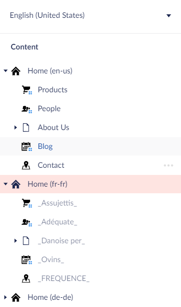
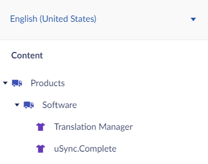
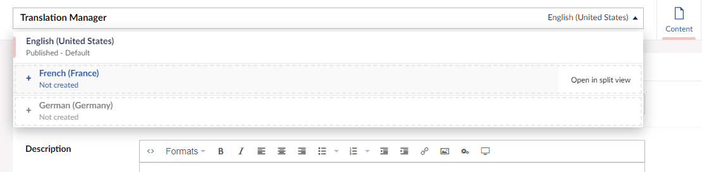

There are two ways of setting up Umbraco for multiple languages. You can either:

- have a content tree for each language, or
- run all of your languages through a single tree and use the Umbraco [Variants](https://our.umbraco.com/documentation/Fundamentals/Backoffice/Variants/) feature.

## Multiple Tree Setup.
If you want to have separate content for each language on your site you can do this by maintaining separate content trees within Umbraco, one for each language: 

## Single Node 
When using variants, all of your languages live under one content tree.

and your languages are managed via the dropdown at the top of the content node

## Which Setup is Right? 
Which of these setups you choose will depend on how you want to manage your content. If **all** of your content is identical for each language on your site, then the variant method may work best as you can keep your content in sync easily. 

If you have some content that only appears for one or some of your languages then you may wish to maintain a separate tree for each language. 

Translation Manager works with both multilingual setups and has built in tools to help you maintain your site and its structure. 