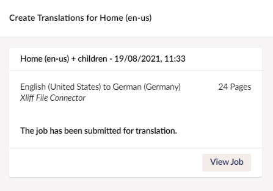
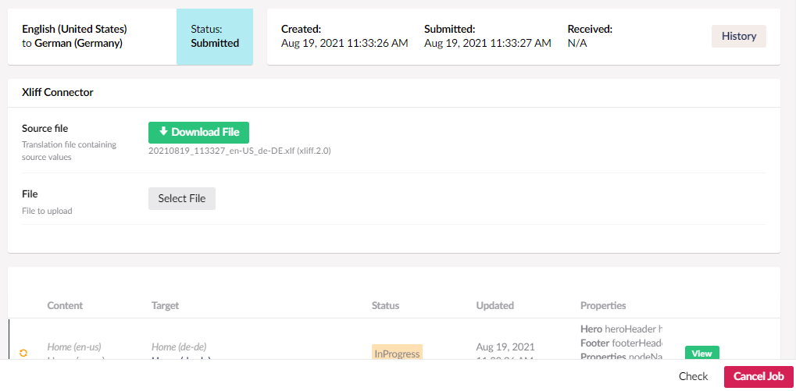

#### Viewing the Job

Once a job has been created you can click the *View Job Button*.

This will take you to the translated job. 

#### Processing the Translation (XLIFF)

With the XLIFF connector, you can download the XLIFF file that has been produced and send it to your translator.

When the translator has finished translating your content, they will return an XLIFF file to you, which you can then upload to the translation job, so Translation Manager will load in the translated content. 

#### Approving the Job 
Once you have your translated content back into the Translation Manager job, you can approve it and it will be pushed back in your Umbraco site. 

- *Approve & Publish* will put the content back into your site and publish the pages.
- *Approve & Save* will put the content back but will not publish the pages, so it won't be live.

