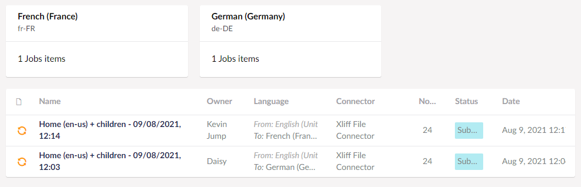

:::note
By default, Translation Manager will [check for returned translations in the background](../userGuide/backgroundchecks) at regular intervals, but this page explains how to check manually.
:::

You can view the progress of jobs in the Translation section of Umbraco.

## Submitted Jobs 

Jobs that you have created will go into the *Submitted* area in the *Translation* section.

Within *Submitted* you can check jobs grouped by language or individually. 

To look at the details of a job, click on it in the list. When you are viewing that job's page you can click the *Check* button, and it will check to see whether the job has been returned by translators.

:::note
Depending on your [translation connector](../reference/fundementals/connector), this process may happen automatically, or you may need to upload a file of translated content.
:::

## Received Jobs
When a job has been received from translation it will move from *Submitted* to *Received*.

When a job has been received you can click on the job in the list and select *View* on any content node to see the returned translations.

You can review the contents of your job, and when you are happy with your translation, click *Close* to return to the list and [approve](approve) it. This will put the content back into your Umbraco site.

