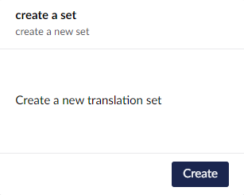
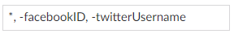

A translation set defines which parts of the content are to be included in translation, as well as the destination of the translated content. 

- Settings -> Translation Manager -> Sets 

- Click the *Create* button to create a a new translation set.

## Sites 

- Pick the site you want your translated content to come from.

- Pick the site you want your translated content to go to.

## Properties 

- Translate Node Name

    Include the node name in the translation. This means the URL will also change for each language as the node name makes up the last part of the URL.

- Properties 

    List properties you don't want to include in translation, for example a product ID or address field. 

    The format for this box is : 

Symbol | Use
-------|---
\*     | include everything
-Name  | don't include properties called "Name"

 For example:

 

 

- Ignore Doctypes

   List of Umbraco doctypes you don't want to be included in translation at all. No properties from these doctypes will ever be sent to translation.

## Connector
 

   Choose a default [connector](../reference/fundementals/connector) to use on translations. 
   
   When selected the connector will be used for all content translated with this [Translation Set](../reference/fundementals/set).
   
   If this option isn't selected the editor will be able to choose a connector when sending content for translation.

## Actions 
 
    
- Copy on Create 
  
    When you create a new Content Item on your master site, Translation Manager will create copies of that page on each language site in this Set. This helps you to keep your master and target sites in sync as you continue to create content. 

- Create and Send Translations 

    Allows your editors to create translation jobs in one step and leaves the [Create Job](send) option on when sending. When this option is off jobs will go via the Pending Queue.

- Choose Version

    Allows editors to choose between saved or published versions when sending content for translation.

- Automatic Approval

    When this button is selected, a job coming back via a Translation connector will be automatically approved (& published) onto your website without you having to review and approve the content. This button is off by default.
