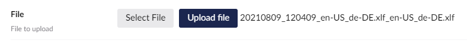

## How to Upload a File
Go to Translation -> Submitted and click on *Select File*. Once you have selected the correct file, click *Upload file*.


## Common Errors
When a file is uploaded, it is checked. There are a common errors we see when invalid or badly formatted XLIFF files are uploaded. 

### Missing &lt;target &gt;
This means the XLIFF file is missing a `target` element (which means it hasn't been translated properly).

> A correctly translated XLIFF file should contain a `<target>` element for every `<source>` element in the file:

e.g 

```
 <group id="g2" name="10|nodeName">
    <unit id="u1" name="10|Umbraco.Textbox">
        <segment>
        <source>Homepage</source>
        <target>Page d'accueil</target>
        </segment>
    </unit>
 </group>
```

When a file is missing a `<target>` value, Translation Manager will indicate the line within the XLIFF file that is missing that value. 


### No Job ID 
This means the XLIFF file isn't for this [Translation Job](../../../reference/fundementals/job), its either for a different job or the ID in the file is wrong.

Translation jobs are transactional, so each job within Translation Manager is unique and references your content at the point in time that the translation was created. The XLIFF file generated by the [Connector](../../../reference/fundementals/connector) can only be used on the translation job it was created for.

The XLIFF file contains the ID of the translation job and the [Translation Node](../../../reference/fundementals/node) ID for each piece of content it contains. 


These IDs should not be changed by the translation process, but if they are, or if you attempt to load an XLIFF file that does not correspond to the current job, then you will see the No Job ID error. 