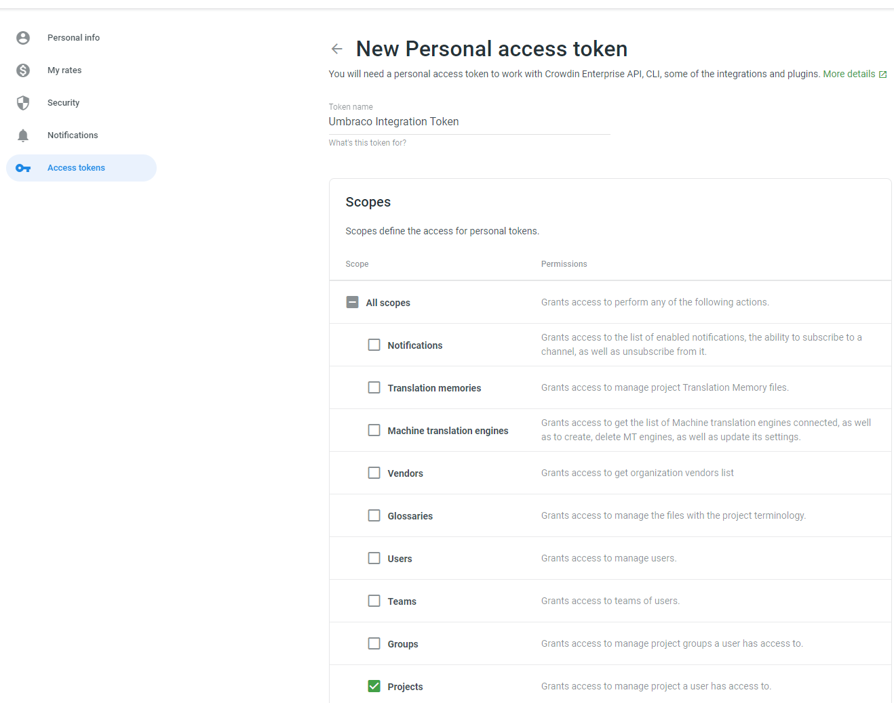
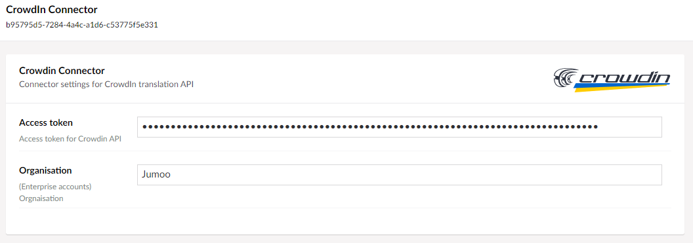
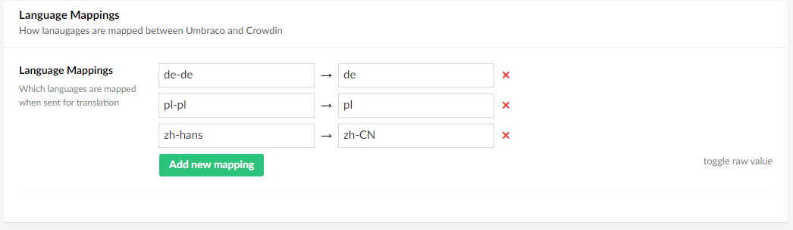

The Crowdin connector allows you to connect your Umbraco installation to the [Crowdin](https://crowdin.com/) translation platform.

## Setup Crowdin 

### 1. Install the Crowdin Connector 

The Crowdin connector has been written for Translation Manager v9 and v10. This connector will work on Umbraco 8, Umbraco 9, and Umbraco 10.

You can install the connector via the command line: 

```cli
dotnet add package Jumoo.TranslationManager.Crowdin
```

or nuget package manager:

```cls
install-package Jumoo.TranslationManager.CrowdIn
```

:::warning Installing on Umbraco 8
The Crowdin Api requires [Newtonsoft.Json](https://www.newtonsoft.com/json) v13+, If you are installing on Umbraco 8 you will need to also update this dependency.
:::

### 2. Obtain Your Crowdin Access Token

In order to connect to Crowdin you will need to generate an Access token via your crowdin account.

1. Login to your Crowdin account.
2. click on your account name in the top right corner of the page.

3. Select Access tokens from the menu.

4. Create a new token.

The Umbraco connector will require access to the project scope to function.
5. Copy your generated token value.


## Umbraco Setup

### 3. Enter the Token in Umbraco

In Umbraco, go to the connector setup in Settings --> Translation Manager --> Connectors.

1. Enter the access token and your Orgnaisation (if you are using Crowdin enterpirse) into the connector setup.
.

### 4. Select default project/folder

You should select a default project and folder to use when creating Crowdin jobs. 


:::tip
You can lock the default project and folder so that editors sending translation don't have to choose these values every time they use the connector.
:::


### 5. Define Lanugage Mappings

Sometimes the languages setup inside your Umbraco site might not completely match those languages that Crowdin uses for translations. 

For example your site might be setup to use "French" (FR), while Crowdin translates using "French (France)" (fr-FR), when this is true you need to tell the Crowdin connector to map your Umbraco languages to the Crowdin Languages. 



With these settings, the Crowdin Connector will map the Umbraco languages to the Crowdin language codes so you can translate directly. 

:::note
If you do not include the correct mappings then you will not be able to create translation jobs on Crowdin.
:::