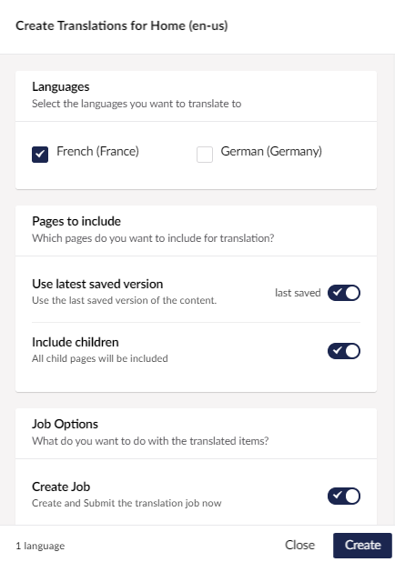

## Send to Translate

Once your set is created you can send your content for translation.

In your source language site:

- Right click on the node you want to have translated.
- Select "Send to Translate" from the menu.

### Send to Translation Dialog

- Choose which languages you want the content to be translated into.
- Select whether or not you want to include child content.
- Click send. 

### Choose a provider

Depending on your setup, you will now see the choose a Connector option. Select [XLIFF Connector.](../Connectors/xliff/xliff)

:::note
The XLIFF connector has no options you can change. Other connectors might give you options here that allow you to change how a job is sent to a translation service
:::

- Click *Send* 

Translation Manager will now create a translation job for your translated content. 
