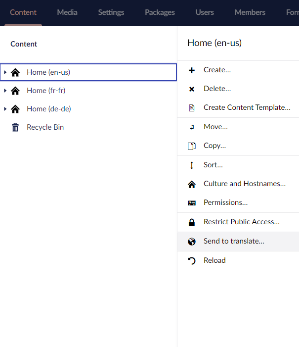
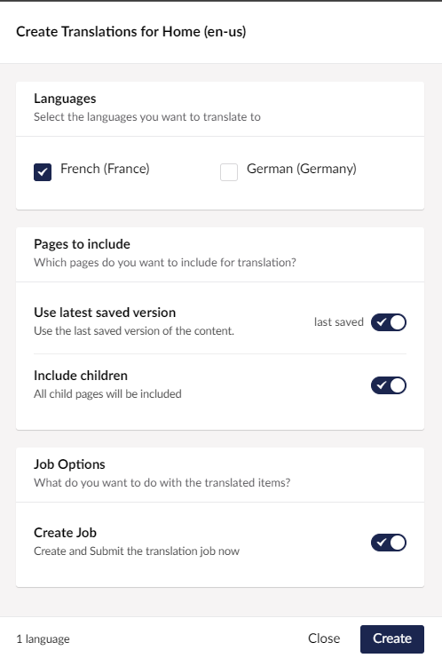

To send content for translation, first select the "Send to translate..." option from the menu. 

You will then see the Send to translate dialog. 

## Languages
- Select the languages you wish to translate using the checkboxes.

## Pages to include 
- Use latest saved version
  - When **selected** the latest saved version of the content is used.
  - When **unselected** the last *published* version of the content will be used. 
- Include children 
  - This will send to translation the whole tree of content, from this point downwards.

## Job Options

- Create Job 

    By default this is selected, to allow immediate creation of a translation job. Deselect to send job to [Pending Queue]. 

## Create Translations for...
This is the [translation connector](../../key_topics/connector) options dialog. 

:::tip 
Depending on the translation connectors you have installed you might see different options here.
:::

Your translation provider may give you options to choose from at this point. Select what you need and continue.

## Completed
Now you will see the Completed screen.

From this point you can go on to view your translation job.
