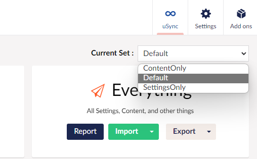

Within uSync you have the option to configure multiple 'Handler Sets'. Each of these sets defines which sync handlers are used and how they behave when running report, import or export events. 

### Select Your Set From the Dashboard.
Ordinarily these sets would only be used programmatically to allow custom code to define what it wants uSync to import or export. Selectable sets mean you can now define these sets so they appear in the uSync dashboard.




## Adding Your Own Set
To add a new set to the drop down, you will need to do two things:

### 1. Define Your Sets in the `appsettings.json` File 

```json title="appsettings.json"
"uSync" : {
    "Sets": {
        "Default": {
        "IsSelectable": true
        },
        "ContentOnly": {
        "IsSelectable": true,
        "DisabledHandlers": [
            "LanguageHandler",
            "DataTypeHandler",
            "TemplateHandler",
            "ContentTypeHandler",
            "MediaTypeHandler",
            "MemberTypeHandler",
            "MacroHandler"
        ]
        },
        "SettingsOnly": {
        "IsSelectable": true,
        "DisabledHandlers": [
            "ContentHandler",
            "MediaHandler",
            "DictionaryHandler",
            "ContentTemplateHandler",
            "RelationTypeHandler",
            "DomainHandler"
        ]
        }
    }
}
```

:::tip 
It's important to remember to set your set to Selectable in the configuration file (`"IsSelectable" : true`) or it will not appear in the dropdown.
:::

### 2. Add A Reference To The Set Configuration Programmatically

Due to the way Umbraco and AspNet Core load their settings you will also need to define your uSync set in code.

```cs
using Microsoft.Extensions.DependencyInjection;

using Umbraco.Cms.Core.Composing;
using Umbraco.Cms.Core.DependencyInjection;

using uSync.BackOffice.Configuration;

using Configuration = uSync.BackOffice.uSync.Configuration;

namespace MyTestSite
{
    public class CustomHandlerSetComposer : IComposer
    {
        public void Compose(IUmbracoBuilder builder)
        {
            // load the config for our ContentOnly set
            builder.Services.Configure<uSyncHandlerSetSettings>(
                "ContentOnly",
                builder.Config.GetSection(Configuration.uSyncSetsConfigPrefix + "ContentOnly"));

            // load the config for our SettingsOnly set
            builder.Services.Configure<uSyncHandlerSetSettings>(
                "SettingsOnly",
                builder.Config.GetSection(Configuration.uSyncSetsConfigPrefix + "SettingsOnly"));
        }
    }
}
```
